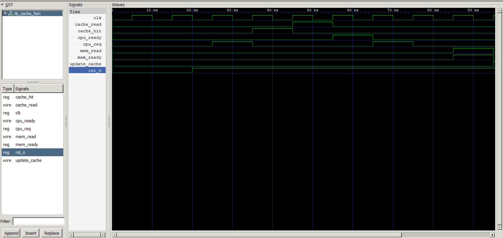

## Cache FSM (Finite State Machine)

## Objective

Implement the **Cache Controller Finite State Machine (FSM)** to control the sequence of cache operations. The FSM determines the flow of a CPU memory request based on cache hit/miss information and coordinates interactions between the cache and the main memory.

At this stage, the FSM implements the basic **read transaction flow**. Full integration with the Address Decoder, Tag RAM, Data RAM, and Memory Interface will be completed in a later phase.

---

## Completed

* Designed a parameterized Cache FSM in SystemVerilog.
* Implemented state transition logic.
* Implemented output control logic.
* Supported cache hit and cache miss flows.
* Developed a standalone SystemVerilog testbench.
* Verified state transitions through simulation.
* Generated waveform (`cache_fsm.vcd`).

---

## FSM States

| State            | Description                                                     |
| ---------------- | --------------------------------------------------------------- |
| **IDLE**         | Waits for a CPU request.                                        |
| **CHECK_CACHE**  | Checks whether the requested cache line is a hit or miss.       |
| **CACHE_HIT**    | Data is available in the cache and can be returned immediately. |
| **MEM_READ**     | Requests data from the main memory after a cache miss.          |
| **UPDATE_CACHE** | Updates the cache with data received from memory.               |
| **COMPLETE**     | Completes the transaction and signals the CPU.                  |

---

## State Diagram

```text
                    +------+
                    | IDLE |
                    +------+
                        |
                 CPU Request
                        |
                        ▼
               +----------------+
               | CHECK_CACHE    |
               +----------------+
                 |            |
             Hit |            | Miss
                 ▼            ▼
          +-------------+   +-----------+
          | CACHE_HIT   |   | MEM_READ  |
          +-------------+   +-----------+
                 |                |
                 |         Memory Ready
                 |                |
                 ▼                ▼
                 |        +----------------+
                 |        | UPDATE_CACHE   |
                 |        +----------------+
                 |                |
                 └────────┬───────┘
                          ▼
                   +--------------+
                   | COMPLETE     |
                   +--------------+
                          |
                          ▼
                        IDLE
```

---

## Module Interface

### Inputs

| Signal      | Description                                                   |
| ----------- | ------------------------------------------------------------- |
| `clk`       | System clock                                                  |
| `rst_n`     | Active-low reset                                              |
| `cpu_req`   | CPU memory request                                            |
| `cache_hit` | Cache hit indicator from the Tag Comparator                   |
| `mem_ready` | Indicates that main memory has completed the requested access |

### Outputs

| Signal         | Description                                     |
| -------------- | ----------------------------------------------- |
| `cache_read`   | Read data from the cache                        |
| `mem_read`     | Request data from main memory                   |
| `update_cache` | Update cache with newly fetched memory data     |
| `cpu_ready`    | Indicates completion of the current CPU request |

---

## Features

* Finite State Machine based control logic
* Separate next-state and output logic
* Supports cache hit flow
* Supports cache miss flow
* Waits for memory response before updating cache
* Modular design for easy integration with the complete cache controller

---

## Test Cases

| Test Case          | Expected Result                                | Status |
| ------------------ | ---------------------------------------------- | ------ |
| Reset FSM          | Returns to `IDLE`                              | ✓      |
| Cache Hit          | Transition to `CACHE_HIT` and complete request | ✓      |
| Cache Miss         | Transition to `MEM_READ`                       | ✓      |
| Memory Ready       | Transition to `UPDATE_CACHE`                   | ✓      |
| Request Completion | Assert `cpu_ready` and return to `IDLE`        | ✓      |

---

## Simulation

Compile

```bash
iverilog -g2012 -o fsm.out rtl/cache_fsm.sv tb/tb_cache_fsm.sv
vvp fsm.out
```

View Waveform

```bash
gtkwave cache_fsm.vcd
```

Alternate (Already Compiled)
```bash
cd result
vvp cache_fsm
```

---

## Waveform



## Results

* The FSM correctly transitioned through all defined states.
* Cache hit requests were completed without accessing main memory.
* Cache miss requests initiated a memory read operation.
* Cache update was performed after the memory became ready.
* The simulation verified the expected control signal behavior for each state.

---
