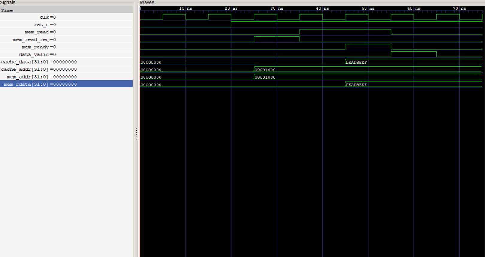

## Memory Interface

## Objective

Implement the **Memory Interface** module to manage communication between the Cache Controller and the external main memory. This module acts as a bridge between the Cache FSM and memory by issuing memory read requests, waiting for memory responses, and forwarding the received data back to the cache.

At this stage, the module implements a simple handshake protocol for memory read transactions. Full integration with the Cache Controller will be completed in the next phase.

---

## Completed

* Designed a parameterized Memory Interface in SystemVerilog.
* Implemented a simple FSM for memory transactions.
* Generated memory read requests.
* Waited for memory ready acknowledgment.
* Forwarded memory data to the cache.
* Generated a data valid signal for the Cache FSM.
* Developed a standalone SystemVerilog testbench.
* Verified memory request and response behavior.
* Generated simulation waveform (`memory_interface.vcd`).

---

## Architecture

```text
                Cache FSM
                    │
            mem_read_req
                    │
                    ▼
          +--------------------+
          | Memory Interface   |
          +--------------------+
            │              │
            │              │
      Memory Read      Memory Data
            │              │
            ▼              ▼
        External Main Memory
```

---

## FSM States

| State        | Description                                                       |
| ------------ | ----------------------------------------------------------------- |
| **IDLE**     | Waits for a memory read request from the Cache FSM.               |
| **WAIT_MEM** | Sends a memory read request and waits for the memory response.    |
| **DONE**     | Delivers the received data to the cache and asserts `data_valid`. |

---

## Module Interface

### Inputs

| Signal         | Description                                               |
| -------------- | --------------------------------------------------------- |
| `clk`          | System clock                                              |
| `rst_n`        | Active-low reset                                          |
| `mem_read_req` | Memory read request from the Cache FSM                    |
| `cache_addr`   | Address requested by the cache                            |
| `mem_ready`    | Indicates that the external memory has completed the read |
| `mem_rdata`    | Data returned by the external memory                      |

### Outputs

| Signal       | Description                                   |
| ------------ | --------------------------------------------- |
| `mem_read`   | Memory read request to the external memory    |
| `mem_addr`   | Address forwarded to the external memory      |
| `data_valid` | Indicates that valid memory data is available |
| `cache_data` | Data returned to the cache                    |

---

## Features

* Parameterized address width
* Parameterized data width
* FSM-based memory handshake
* Simple synchronous control
* Data valid generation
* Modular and reusable RTL
* Ready for top-level integration

---

## Test Cases

| Test Case                 | Expected Result                 | Status |
| ------------------------- | ------------------------------- | ------ |
| Reset interface           | Returns to `IDLE`               | ✓      |
| Issue memory read request | `mem_read` asserted             | ✓      |
| Wait for memory response  | Interface remains in `WAIT_MEM` | ✓      |
| Memory ready asserted     | `data_valid` generated          | ✓      |
| Memory data forwarded     | Cache receives correct data     | ✓      |

---

## Simulation

Compile

```bash
iverilog -g2012 -o mem_if.out rtl/memory_interface.sv tb/tb_memory_interface.sv
vvp mem_if.out
```

View Waveform

```bash
gtkwave memory_interface.vcd
```

Alternate (Already Compiled)
```bash
cd result
vvp memory_interface
```
---

## Waveform

The following waveform verifies the memory request generation, handshake with the external memory, and data transfer back to the cache.




---

## Results

* The Memory Interface successfully accepted a memory read request from the Cache FSM.
* The requested address was forwarded to the external memory.
* The module correctly waited for the `mem_ready` handshake before completing the transaction.
* Memory data was successfully transferred to the cache interface.
* The design was verified through simulation and waveform analysis.

---


