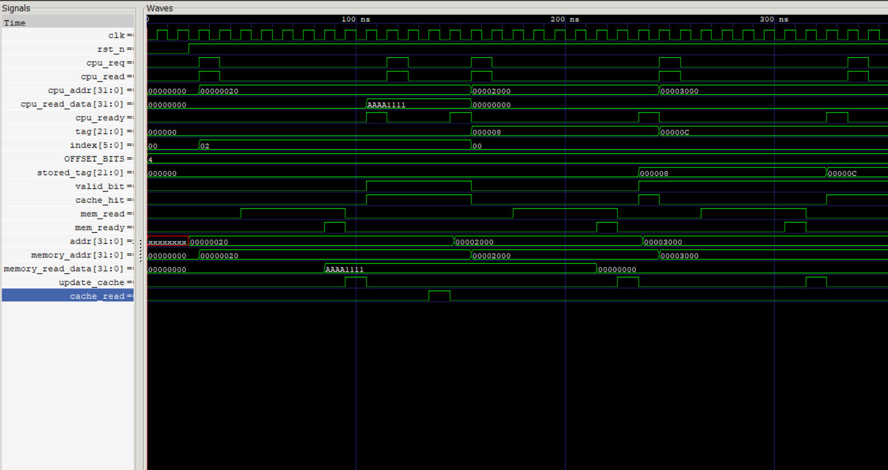
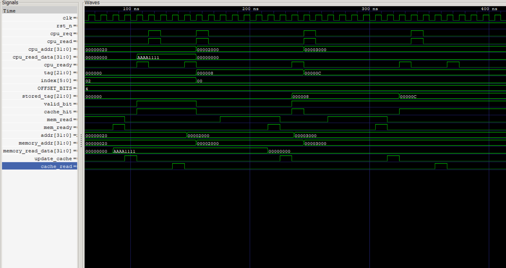

## Cache Controller Top Module

## Overview

`cache_controller_top` is the top-level integration module of the 32-bit L1 Direct-Mapped Cache Controller.

This module connects all cache sub-blocks including address decoder, tag RAM, data RAM, tag comparator, cache FSM, memory interface, and main memory to provide complete cache operation.

The module acts as an interface between the CPU and cache subsystem, handling CPU read requests, cache hit/miss detection, and data transfer from main memory during cache misses.

---

## Responsibilities

The top module performs the following functions:

- Integrates all cache components into a single RTL design.
- Provides CPU interface for read requests and data response.
- Generates cache hit/miss information using tag comparison.
- Controls cache access through FSM generated control signals.
- Manages communication between cache and main memory.
- Updates cache data after memory refill.

---

## Simulation

### Compile RTL and Testbench

```bash
iverilog -g2012 -o cache.out \
rtl/address_decoder.sv \
rtl/tag_ram.sv \
rtl/data_ram.sv \
rtl/tag_comparator.sv \
rtl/cache_fsm.sv \
rtl/memory_interface.sv \
rtl/main_memory.sv \
rtl/cache_controller_top.sv \
tb/tb_cache_controller_top.sv
```

Run Simulation 
```bash
vvp cache.out
```

## Waveform

```bash
gktwave cache_controller_top.vcd
```


