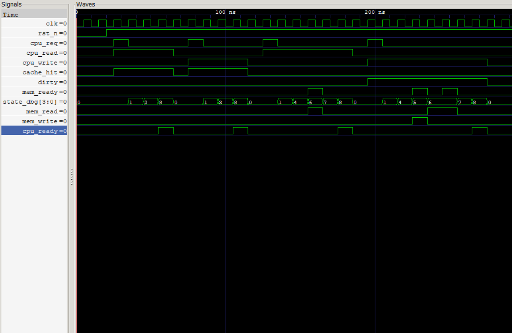

## Cache FSM v2

## Overview

The **Cache FSM v2** is the control unit of the cache controller. It coordinates cache access, memory transactions, and CPU responses using a Finite State Machine (FSM). Compared to the previous version, this implementation supports both **read** and **write** operations along with **cache hit**, **cache miss**, **dirty line handling**, and **cache line allocation**.

This module acts as the central controller that connects the CPU, cache memories, and memory interface.

---

## Features

- Supports CPU Read Requests
- Supports CPU Write Requests
- Detects Cache Hits and Cache Misses
- Handles Dirty Cache Lines
- Performs Write-Back before replacement
- Allocates new cache lines after a miss
- Updates cache after memory fetch
- Generates CPU Ready signal after transaction completion
- Provides `state_dbg` output for debugging and waveform analysis

---

## FSM States

| State | Description |
|--------|-------------|
| IDLE | Waits for a CPU request |
| COMPARE_TAG | Checks whether the requested tag is present in cache |
| READ_HIT | Read data directly from cache |
| WRITE_HIT | Update cache data on a write hit |
| CHECK_DIRTY | Determines whether the current cache line must be written back |
| WRITE_BACK | Writes dirty cache line to main memory |
| ALLOCATE | Requests a new cache line from main memory |
| UPDATE_CACHE | Updates Tag RAM and Data RAM with new cache line |
| COMPLETE | Signals transaction completion to CPU |

---

## Supported Cache Operations

### Read Hit

```text
IDLE
 ↓
COMPARE_TAG
 ↓
READ_HIT
 ↓
COMPLETE
```

---

### Write Hit

```text
IDLE
 ↓
COMPARE_TAG
 ↓
WRITE_HIT
 ↓
COMPLETE
```

---

### Read Miss (Clean Line)

```text
IDLE
 ↓
COMPARE_TAG
 ↓
CHECK_DIRTY
 ↓
ALLOCATE
 ↓
UPDATE_CACHE
 ↓
COMPLETE
```

---

### Write Miss (Dirty Line)

```text
IDLE
 ↓
COMPARE_TAG
 ↓
CHECK_DIRTY
 ↓
WRITE_BACK
 ↓
ALLOCATE
 ↓
UPDATE_CACHE
 ↓
COMPLETE
```

---

## Inputs

| Signal | Description |
|---------|-------------|
| clk | System clock |
| rst_n | Active-low reset |
| cpu_req | CPU request valid |
| cpu_read | Read request from CPU |
| cpu_write | Write request from CPU |
| cache_hit | Cache hit indicator |
| dirty | Dirty bit from Tag RAM |
| mem_ready | Main memory transaction complete |

---

## Outputs

| Signal | Description |
|---------|-------------|
| cache_read | Enables cache read operation |
| cache_write | Enables cache write operation |
| mem_read | Initiates memory read |
| mem_write | Initiates memory write-back |
| update_cache | Updates cache after memory fetch |
| cpu_ready | Indicates completion of CPU request |
| state_dbg | Current FSM state for debugging |

---

## Verification

A dedicated SystemVerilog testbench verifies all major cache operations.

### Test Cases

- Reset Verification
- Read Hit
- Write Hit
- Read Miss (Clean Cache Line)
- Write Miss (Dirty Cache Line)
- Memory Read Handshake
- Memory Write-Back Handshake
- Cache Update
- CPU Ready Generation

---

## Simulation

Compile

```bash
iverilog -g2012 -o fsm_v2.out rtl/cache_fsm_v2.sv tb/tb_cache_fsm_v2.sv
vvp fsm_v2.out
```

Waveform

```bash
gtkwave cache_fsm_v2.vcd
```

Alternate (Already Compiled)
```bash
cd result
vvp cache_fsm_v2
```
---

---

## Waveform

The following waveform verifies the memory request generation, handshake with the external memory, and data transfer back to the cache.




---